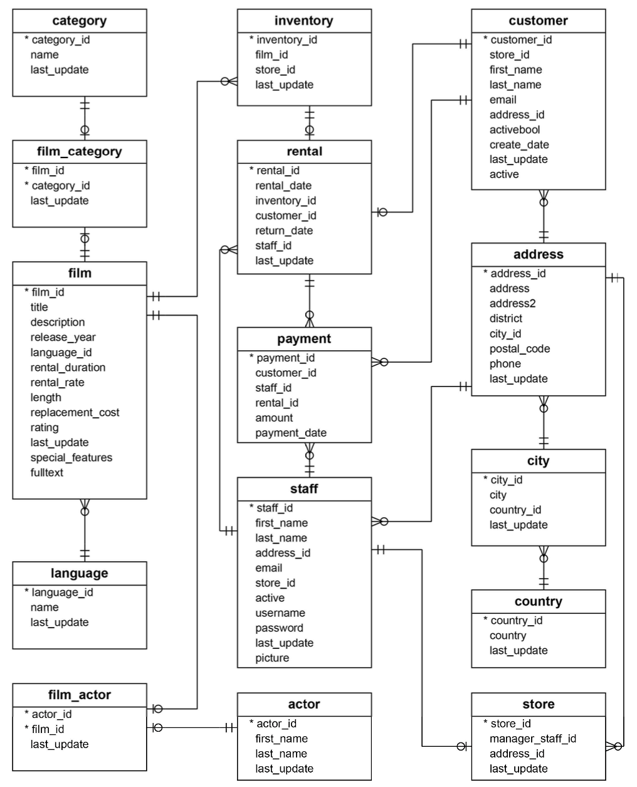

# PostgreSQL Sandbox Setup

Prerequisites:
- Download [Docker Desktop](https://www.docker.com/products/docker-desktop/) to your computer.
- (Optional) Download [DBGate](https://dbgate.org/) to your computer. This is one of many SQL IDE options. If you have a preferred IDE, feel free to use that instead.

Getting Started:
1. Clone this repository using the command `git clone git@github.com:pohek321/sql-course.git`
2. Ensure Docker Desktop is running on your computer
3. Run the command `make up` to create a Docker container running a PostgreSQL database
4. Run the command `make load` to load the Docker PostgreSQL database with sample data

# Data Model
Read more on the origin of this data model [here](https://www.postgresqltutorial.com/postgresql-getting-started/postgresql-sample-database/)

